# 第一次实验报告：

[实验一](#实验一)

[实验二](#实验二)

1. 参照课本1.1.1，自选2个网址（1个国内的，如www.baidu.com, 一个国外的，如 www.stanford.edu ） 运行 ping 命令的各种选项；记录实验结果，简单说明观察到的ping 2个不同网站的输出的不同点；
    
    ### **ping** 命令

    `ping` 命令用于测试网络连接的可达性和延迟，以下是一些常用的 `ping` 命令选项：

    1. `-c`：发送指定数量的ECHO_REQUEST包后停止。
    2. `-i`：指定发送包的时间间隔。
    3. `-l`：设置在发送包之前，包在缓冲区中等待的时间。
    4. `-s`：设置要发送的包的大小。
    5. `-v`：详细模式，显示更多的信息。

    ### 实验结果记录：
    
    #### **国内：** www.baidu.com

    1. `ping www.baidu.com`

        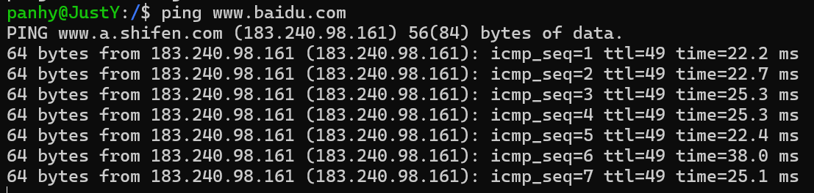

    2. `ping -c 4 www.baidu.com`：指定要发送的ECHO_REQUEST包的数量为4
        
        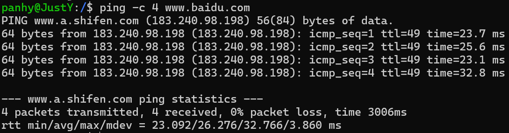

    3. `ping -i 2 www.baidu.com`：设置发送ECHO_REQUEST包的时间间隔为2秒

        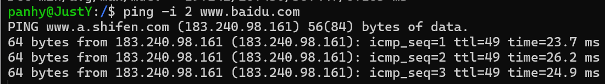

    4. `ping -s 64 www.baidu.com`：设置要发送的包的大小（以字节为单位）为64

        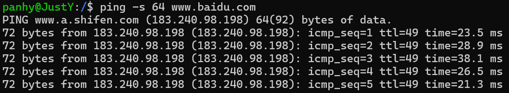

    #### **国外：** www.stanford.edu

    1. `ping www.stanford.edu`

        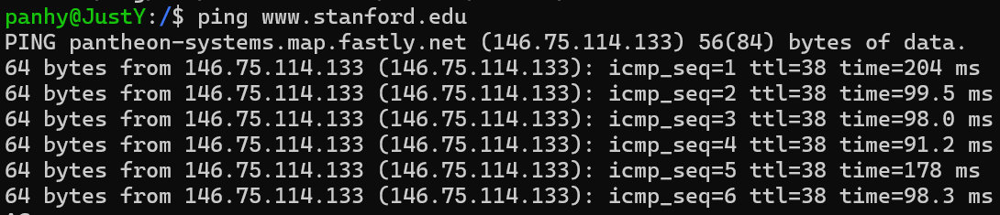

    2. `ping -c 4 www.stanford.edu`：指定要发送的ECHO_REQUEST包的数量为4
        
        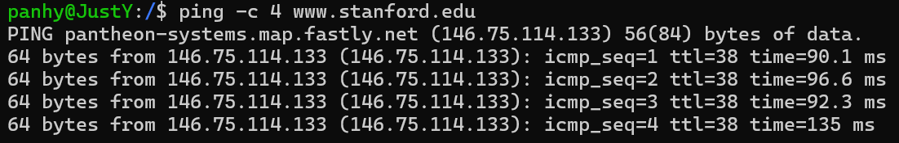

    3. `ping -i 2 www.stanford.edu`：设置发送ECHO_REQUEST包的时间间隔为2秒

        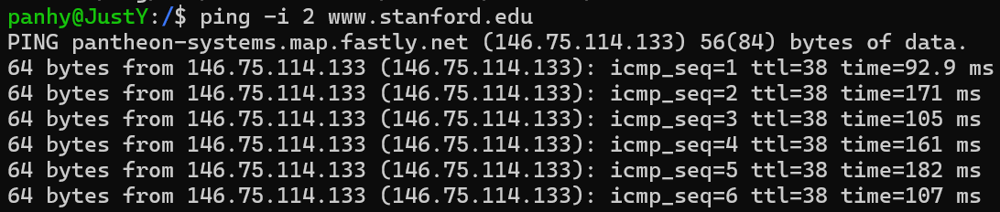

    4. `ping -s 64 www.stanford.edu`：设置要发送的包的大小（以字节为单位）为64

        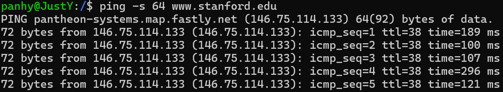

    ### 不同点

    #### 1. 目标IP地址和域名解析
    - **www.baidu.com** 的请求被解析到了 IP 地址 **183.240.98.198**，并且显示的域名是 **www.a.shifen.com**。这表明百度可能使用了某种形式的负载均衡或内容分发网络（CDN），其中 `a.shifen.com` 是实际处理请求的服务器域名。
    - **www.stanford.edu** 的请求被解析到了 IP 地址 **146.75.114.133**，并且显示的域名是 **pantheon-systems.map.fastly.net**。这同样表明斯坦福大学的网站也使用了 CDN 服务，由 Fastly 提供。

    #### 2. 响应时间（RTT）
    - **www.baidu.com** 的响应时间波动较小，这表明连接到百度的服务器相对稳定，延迟较低。
    - **www.stanford.edu** 的响应时间波动较大，平均时间较高。

    #### 3. TTL（Time to Live）
    - **www.baidu.com** 的 TTL 值为 49，这表明数据包在到达目标服务器之前经过的路由器数量较少。
    - **www.stanford.edu** 的 TTL 值为 38，这同样表明数据包在到达目标服务器之前经过的路由器数量较少。TTL 值的差异可能反映了不同的网络架构或路由策略。

    #### 4. 网络稳定性
    - 百度的 `ping` 测试显示了较低的延迟和较小的波动，这可能意味着网络连接较为稳定。
    - 斯坦福大学的 `ping` 测试显示了较高的延迟和较大的波动，这可能意味着网络连接的稳定性较低，或者受到了更多的网络拥塞影响。

2. 参照课本1.1.2，自选2个网址（1个国内的，如www.baidu.com, 一个国外的，如 www.stanford.edu ） 运行 tracert 命令的各种选项；记录实验结果，简单说明观察到的tracert 2个不同网站的输出的不同点；

    ### tracert 命令

    `tracert` 是一个网络诊断工具，用于显示数据包从你的计算机到目标主机所经过的路由路径。以下是一些常用的 tracert 命令选项：

    Windows 系统中的 tracert 选项：

    1. -d：指定不将地址解析为主机名。默认情况下，tracert 会尝试将每个 IP 地址解析为对应的主机名。
    2. -h <最大跃点数>：指定搜索目标的最大跃点数。跃点数是数据包在到达目标主机之前所经过的路由器数量。
    3. -w <等待每个回复的时间>：指定等待每个跃点的响应的时间（以毫秒为单位）。
    4. -r：指定不使用本地路由表，而是通过连续跳转来测试到达目标的路由。
    5. -s <指定的源地址>：指定源地址，用于发送 tracert 消息。
    6. -j <跳过主机列表>：指定一系列 IP 地址，tracert 将跳过这些地址。
    7. -i <接口>：指定网络接口，用于发送 tracert 消息。

    ### 实验结果记录：

    #### **国内：** www.baidu.com

    1. `tracert www.baidu.com`

        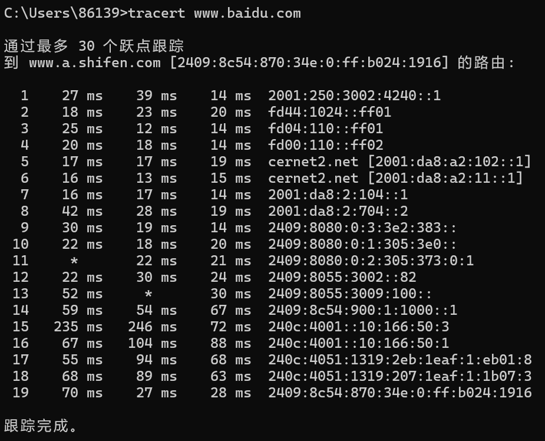

    2. `tracert -h 20 www.baidu.com`：指定最大跃点数为20

        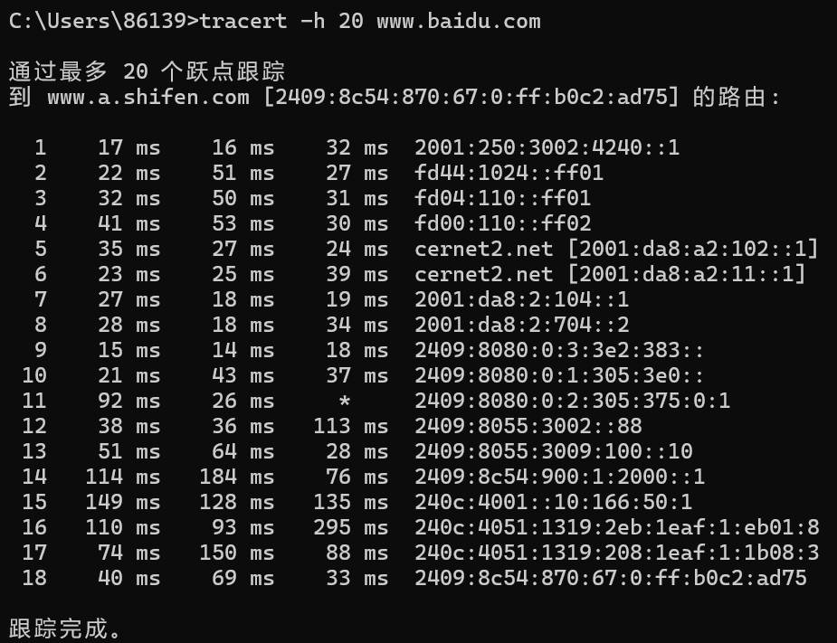

    3. `tracert -d www.baidu.com`：不解析主机名

        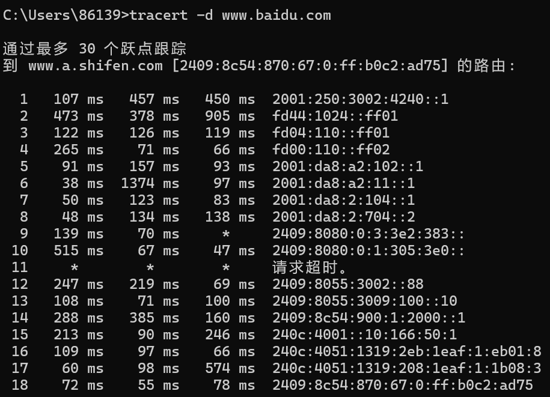

    #### **国外：** www.stanford.edu

    1. `tracert www.stanford.edu`

        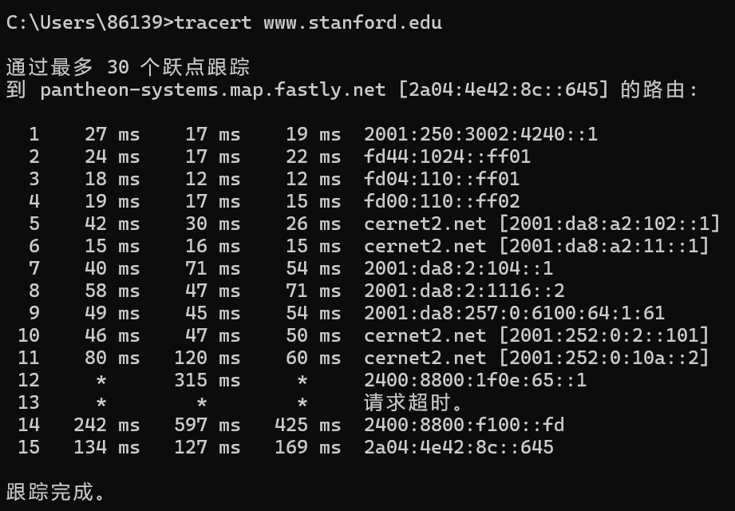

    2. `tracert -h 20 www.stanford.edu`：指定最大跃点数为20

        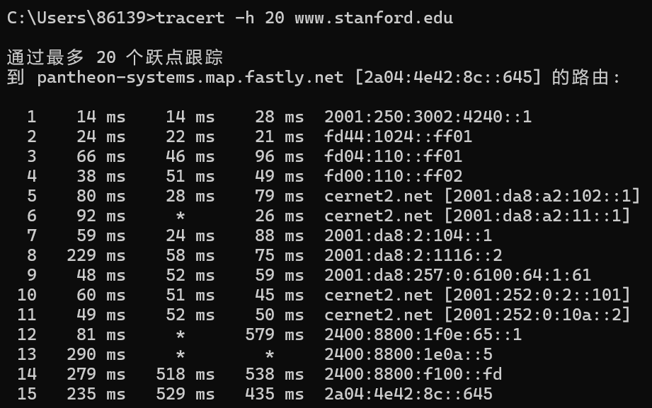

    3. `tracert -d www.stanford.edu`：不解析主机名

        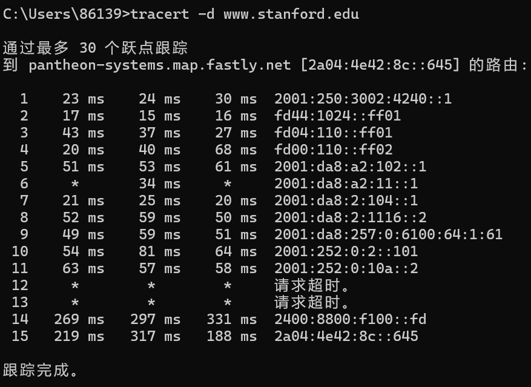

    ### 不同点

    不同点主要体现在跃点数量、延迟、丢包以及使用的IP地址类型上：

    #### 1. 跃点数量
    - **www.baidu.com**：追踪到了19个跃点，显示了数据包到达目标的完整路径。
    - **www.stanford.edu**：追踪到了15个跃点，但在第13跃点出现了请求超时，表明在该跃点可能存在网络连接问题。

    #### 2. 延迟
    - **www.baidu.com**：延迟相对稳定，大多数跃点的延迟在20-40ms之间，表明网络连接较为稳定。
    - **www.stanford.edu**：延迟较高，特别是在第12跃点和第14跃点，延迟显著增加，表明网络连接可能受到距离或路由选择的影响。

    #### 3. 丢包
    - **www.baidu.com**：在第11跃点出现了一次丢包（*），这可能是暂时的网络波动或特定跃点的网络问题。
    - **www.stanford.edu**：在第12和第13跃点出现了丢包和请求超时，表明这些跃点可能存在较严重的网络问题。

    #### 4. 网络路径
    - **www.baidu.com**：路径中的多个跃点使用了 `cernet2.net`，这可能是中国教育和科研计算机网的一部分，表明数据包在国内网络中传输。
    - **www.stanford.edu**：路径中的多个跃点使用了不同的网络，包括 `cernet2.net` 和其他网络，这表明数据包在到达目标之前经过了多个不同的网络。
