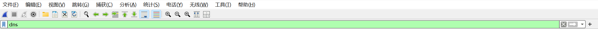
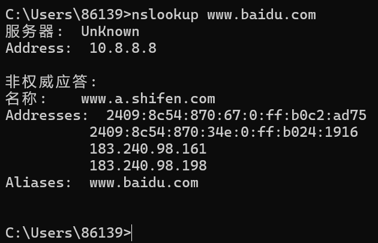
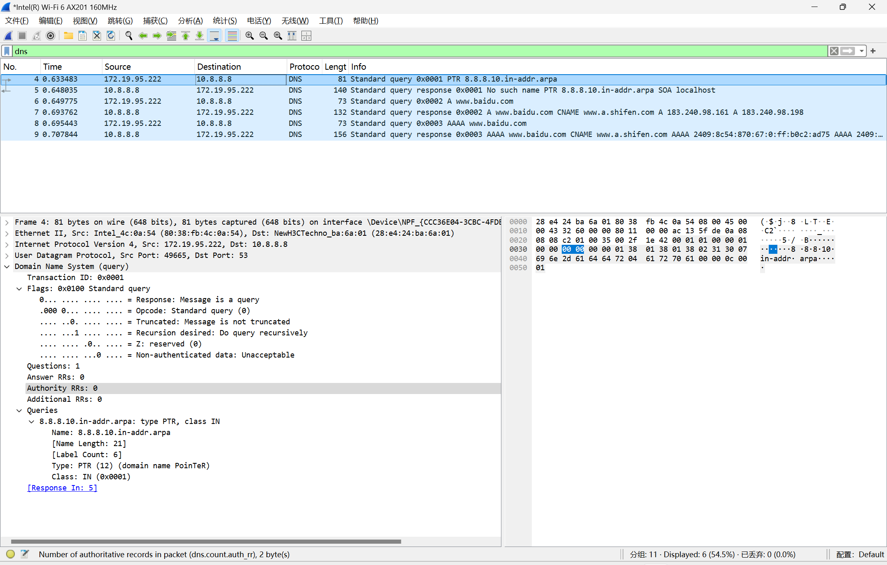

# 第三次实验报告

## 实验 2-6 DNS 协议分析

[实验内容](#1)

[实验思考](#2)

### 实验内容

1. 启动 Wireshark, 选定侦听网卡, 开始抓包：

    在过滤器中输入 `dns`，选择抓取 DNS 包。

    

2. 切换到命令提示窗口, 在命令提示符下输入 `nslookup www.baidu.com`, 分析执行结果：

    `nslookup` 是一个用于查询 DNS（域名系统）的网络管理工具，它允许用户查找域名与 IP 地址之间的映射关系，或者查找 DNS 服务器的相关信息。

    执行结果如下：

    

   1. **服务器**：
      - 服务器地址是 `10.8.8.8`，这通常是本地 DNS 服务器的地址。

   2. **非权威应答**：
      - 这意味着 DNS 服务器不是权威服务器（即不是域名的原始注册服务器），但仍然提供了查询结果。
       - **权威应答**：由域名的权威 DNS 服务器提供，这些服务器包含域名的官方记录。
      - **非权威应答**：由非权威 DNS 服务器提供，这些服务器可能缓存了域名的记录，但不是最新的。
   3. **名称**：
      - `www.a.shifen.com` 可能是 `www.baidu.com` 的一个别名或 CNAME 记录。

   4. **地址**：
      - 显示了多个 IP 地址，包括 IPv6 和 IPv4 地址：
        - IPv6 地址：`2409:8c54:870:67:0:ff:b0c2:ad75` 和 `2409:8c54:870:34e:0:ff:b024:1916`
        - IPv4 地址：`183.240.98.161` 和 `183.240.98.198`

   5. **别名**：
      - `www.baidu.com` 表示查询的域名。
      - 别名（CNAME）记录是一种 DNS 记录，它将一个域名映射到另一个域名。在这种情况下，`www.a.shifen.com` 可能是 `www.baidu.com` 的一个别名。

3. 分析 Wireshark 捕获的数据, 观察 `nslookup` 的通信过程, 正常情况下能够捕获到 4 帧, 试具体分析捕获的数据包中 DNS 的报文格式细节。

    捕获的信息如下：

    

    

4. 继续使用协议分析仪进行数据的捕获, 再次访问 `www.baidu.com`, 观察此时是否还有DNS请求?

5. 关闭浏览器后再重新打开, 访问一个尚未访问过的网站, 例如 `www.sohu.com`, 观察此时是否有 DNS 请求? 为什么?

6. 在 Windows 系统的命令提示符下运行 `ipconfig /displaydns`, 显示本机缓冲区中的 DNS 解析内容。

7. 在 Windows 系统的命令提示符下运行 `ipconfig /flushdns`, 则可以清除本机的 DNS 缓存记录。

8. 关闭浏览器再打开, 访问刚才打开过的网站, 观察是否有 DNS 请求? 为什么?

### 实验思考

1. DNS 协议中的资源记录 RR (Record Resource) 包含哪些内容?

2. DNS 除了返回需查找的域名还可能返回哪些内容?

3. 反复实验,判断一个域名是否可以对应多个地址? 域名与 IP 地址之间是否有一一对应的关系?

4. 若实验中无法进行 DNS 解析, 请写出导致问题的原因及解决办法。

5. DNS 协议何时用 UDP? 何时用 TCP?

