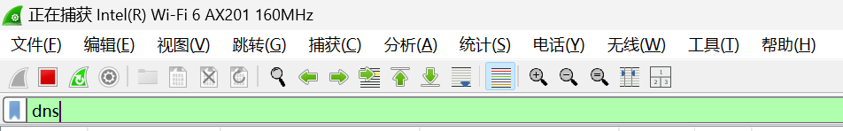
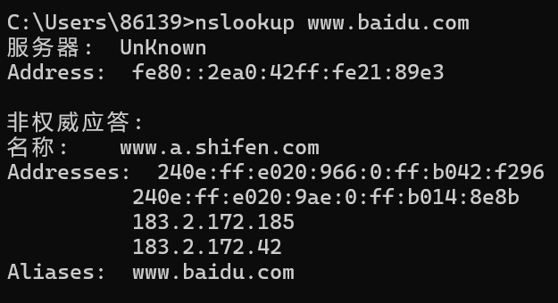
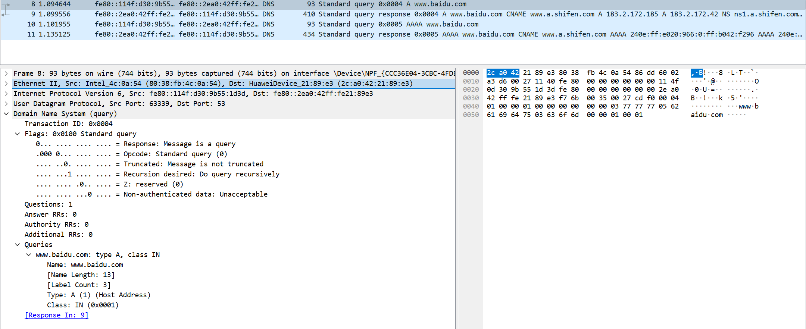

# 第三次实验报告

## 实验 2-6 DNS 协议分析

[实验内容](#1)

[实验思考](#2)

### 实验内容

1. 启动 Wireshark, 选定侦听网卡, 开始抓包：

    在过滤器中输入 `dns`，选择抓取 DNS 包。

   

2. 切换到命令提示窗口, 在命令提示符下输入 `nslookup www.baidu.com`, 分析执行结果：

    `nslookup` 是一个用于查询 DNS（域名系统）的网络管理工具，它允许用户查找域名与 IP 地址之间的映射关系，或者查找 DNS 服务器的相关信息。

    执行结果如下：

   

   1. **服务器**：正在使用的 DNS 服务器的地址是 `fe80::2ea0:42ff:fe21:89e3`，这是一个 IPv6 地址。

   2. **非权威应答**：表示 DNS 服务器不是 `www.baidu.com` 的授权 DNS 服务器，所以它提供的信息可能不是最新的。

   3. **名称**：`www.a.shifen.com` 是 `www.baidu.com` 的一个别名（CNAME）。

   4. **地址**：列出了 `www.a.shifen.com` 的多个 IP 地址，包括 IPv6 和 IPv4 地址：
      - IPv6 地址：`240e:ff:e020:966:0:ff:b042:f296` 和 `240e:ff:e020:9ae:0:ff:b014:8e8b`
      - IPv4 地址：`183.2.172.185` 和 `183.2.172.42`

   5. **别名**：`www.baidu.com` 是 `www.a.shifen.com` 的一个别名。

3. 分析 Wireshark 捕获的数据, 观察 `nslookup` 的通信过程, 正常情况下能够捕获到 4 帧, 试具体分析捕获的数据包中 DNS 的报文格式细节。

    捕获的信息如下：

   

   报文分析：

   可以看到，网络传输层使用 UDP 协议，端口号为 53。

   DNS报文基础结构部分：

   事务 ID（Transaction ID）：DNS 报文的 ID 标识。对于请求报文和其对应的应答报文，该字段的值是相同的。通过它可以区分 DNS 应答报文是对哪个请求进行响应的。

   标志（Flags）：DNS 报文中的标志字段。

   问题计数（Questions）：DNS 查询请求的数目。

   回答资源记录数（Answers RRs）：DNS 响应的数目。

   权威名称服务器计数（Authority RRs）：权威名称服务器的数目。

   附加资源记录数（Additional RRs）：额外的记录数目（权威名称服务器对应 IP 地址的数目）。

   其中Flags字段中每个字段的含义如下：

   QR（Response）：查询请求/响应的标志信息。查询请求时，值为 0；响应时，值为 1。

   Opcode：操作码。其中，0 表示标准查询；1 表示反向查询；2 表示服务器状态请求。

   AA（Authoritative）：授权应答，该字段在响应报文中有效。值为 1 时，表示名称服务器是权威服务器；值为 0 时，表示不是权威服务器。

   TC（Truncated）：表示是否被截断。值为 1 时，表示响应已超过 512 字节并已被截断，只返回前 512 个字节。

   RD（Recursion Desired）：期望递归。该字段能在一个查询中设置，并在响应中返回。该标志告诉名称服务器必须处理这个查询，这种方式被称为一个递归查询。如果该位为 0，且被请求的名称服务器没有一个授权回答，它将返回一个能解答该查询的其他名称服务器列表。这种方式被称为迭代查询。

   RA（Recursion Available）：可用递归。该字段只出现在响应报文中。当值为 1 时，表示服务器支持递归查询。
   Z：保留字段，在所有的请求和应答报文中，它的值必须为 0。

   rcode（Reply code）：返回码字段，表示响应的差错状态。
   当值为 0 时，表示没有错误；
   当值为 1 时，表示报文格式错误（Format error），服务器不能理解请求的报文；
   当值为 2 时，表示域名服务器失败（Server failure），因为服务器的原因导致没办法处理这个请求；
   当值为 3 时，表示名字错误（Name Error），只有对授权域名解析服务器有意义，指出解析的域名不存在；
   当值为 4 时，表示查询类型不支持（Not Implemented），即域名服务器不支持查询类型；
   当值为 5 时，表示拒绝（Refused），一般是服务器由于设置的策略拒绝给出应答，如服务器不希望对某些请求者给出应答，，或者服务器不希望进行某些操作（比如区域传送zone transfer）；
   6-15 保留值，暂时未使用。

   DNS报文问题查询部分：

   查询名（Name）：一般为要查询的域名，有时也会是 IP 地址，用于反向查询。

   查询类型（Type）：DNS 查询请求的资源类型。通常查询类型为 A 类型，表示由域名获取对应的 IP4 地址。（更多类型如 AAAA，CANME，SOA，PTR，NS 等）

   查询类（Class）：地址类型，通常为互联网地址，值为 1。

   

   报文分析：

   响应报文中，Queries字段完全和请求报文相同，answers字段为DNS资源记录部分的内容。

   DNS资源记录：

   Name：DNS 请求的域名。

   Type：资源记录的类型，与问题部分中的查询类型值是一样的。

   Class：地址类型，与问题部分中的查询类值是一样的。

   Time to live：生存时间，以秒为单位，表示资源记录的生命周期，一般用于当地址解析程序取出资源记录后决定保存及使用缓存数据的时间。它同时也可以表明该资源记录的稳定程度，稳定的信息会被分配一个很大的值。

   Data length：资源数据的长度。

   资源数据：表示按查询段要求返回的相关资源记录的数据。（如 Address :IP地址，CNAME:服务器别名等）

4. 继续使用协议分析仪进行数据的捕获, 再次访问 `www.baidu.com`, 观察此时是否还有DNS请求?

   在捕获数据时没有看到DNS请求，这通常意味着DNS信息已经被缓存。

   浏览器缓存：浏览器通常会缓存DNS解析结果，以减少网络延迟和提高访问速度。当你再次访问同一个网站时，浏览器会首先检查缓存中是否有该域名的IP地址。

   操作系统缓存：操作系统也维护一个DNS缓存，称为DNS客户端缓存。当浏览器缓存中没有DNS信息时，操作系统会检查其DNS缓存。

   路由器缓存：一些路由器也支持DNS缓存功能，以提高网络性能。

5. 关闭浏览器后再重新打开, 访问一个尚未访问过的网站, 例如 `www.sohu.com`, 观察此时是否有 DNS 请求? 为什么?

   观察到一个DNS请求。以下是原因：

   1. **缓存未命中**：由于之前没有访问过 `www.sohu.com`，浏览器的缓存中可能没有该网站的DNS解析记录。

   2. **操作系统缓存**：即使浏览器缓存中没有记录，操作系统也可能有DNS缓存。但是，如果该域名不在操作系统的DNS缓存中，或者缓存已经过期，那么操作系统也会发起新的DNS请求。

   3. **路由器缓存**：如果操作系统的DNS缓存中没有记录，路由器可能会缓存DNS解析结果。但如果路由器的缓存中也没有该网站的记录，或者缓存已经过期，那么路由器也会发起新的DNS请求。

6. 在 Windows 系统的命令提示符下运行 `ipconfig /displaydns`, 显示本机缓冲区中的 DNS 解析内容。

   

7. 在 Windows 系统的命令提示符下运行 `ipconfig /flushdns`, 则可以清除本机的 DNS 缓存记录。

   

8. 关闭浏览器再打开, 访问刚才打开过的网站, 观察是否有 DNS 请求? 为什么?

   有dns请求：

   这可能是由于以下原因：

   1. **浏览器缓存已清除**：当你关闭浏览器时，可能也清除了浏览器的DNS缓存，因此浏览器需要重新发起DNS请求来解析域名。

   2. **操作系统DNS缓存**：尽管你可以通过`ipconfig /flushdns`命令清除Windows的DNS缓存，但操作系统的DNS缓存可能仍然存在，并且可能没有被清除。

   3. **路由器缓存**：路由器可能有自己的DNS缓存，如果路由器缓存了该网站的DNS信息，它可能在没有再次发起DNS请求的情况下提供这些信息。

### 实验思考

1. DNS 协议中的资源记录 RR (Record Resource) 包含哪些内容?

   DNS协议中的资源记录（Resource Record，简称RR）是DNS消息中用于表达域名和IP地址之间映射关系的数据结构。一个资源记录通常包含以下内容：

   1. **域名（Name）**：资源记录的主机名或域名，例如 `www.example.com`。

   2. **类型（Type）**：资源记录的类型，最常见的类型包括：
      - A：IPv4地址
      - AAAA：IPv6地址
      - CNAME：规范名称（Canonical Name）
      - MX：邮件交换服务器
      - TXT：文本记录
      - NS：域名服务器
      - PTR：反向查询的指针
      - SRV：服务记录

   3. **类（Class）**：资源记录的类别，最常见的是IN，代表Internet。

   4. **生存时间（Time to Live，TTL）**：资源记录在DNS缓存中可以保存的秒数。TTL值告诉DNS客户端或中间DNS服务器在记录过期之前可以缓存该记录多长时间。

   5. **数据长度（Data Length）**：资源记录数据部分的长度，以字节为单位。

   6. **数据（Data）**：资源记录的实际数据，其内容取决于记录的类型：
      - 对于A记录，数据就是IPv4地址。
      - 对于AAAA记录，数据就是IPv6地址。
      - 对于CNAME记录，数据是规范名称的域名。
      - 对于MX记录，数据是邮件服务器的域名。
      - 对于TXT记录，数据是一系列文本字符串。
      - 对于NS记录，数据是权威名称服务器的域名。
      - 对于PTR记录，数据是反向查询的域名。
      - 对于SRV记录，数据包含服务的域名、端口号以及可能的优先级和权重信息。

   资源记录是DNS数据库中的基本单元，DNS查询和响应都是建立在资源记录的基础上进行的。当一个DNS查询请求被发送到DNS服务器时，服务器会查找请求的资源记录并返回相应的数据。

2. DNS 除了返回需查找的域名还可能返回哪些内容?

   DNS（域名系统）除了返回请求的域名对应的IP地址或其他资源记录外，还可能返回以下内容：

   1. **权威名称服务器（Authoritative Name Servers）**：
      如果DNS服务器是权威服务器，它会返回与请求的域名相关的所有资源记录，包括但不限于A记录、AAAA记录、MX记录、CNAME记录等。

   2. **别名（CNAME）**：
      如果请求的域名设置了一个规范名称（Canonical Name）记录，DNS响应会返回一个CNAME记录，指向域名的规范名称。

   3. **邮件交换服务器（MX记录）**：
      当查询类型为MX时，DNS会返回邮件交换服务器的记录，用于邮件服务器的地址解析。

   4. **文本记录（TXT记录）**：
      这些记录通常用于提供关于域名的额外信息，如用于SPF（Sender Policy Framework）记录的反垃圾邮件措施。

3. 反复实验,判断一个域名是否可以对应多个地址? 域名与 IP 地址之间是否有一一对应的关系?

   域名与IP地址之间没有严格的一一对应关系。一个域名可以对应多个IP地址，同样，一个IP地址也可以被多个域名使用。这种现象在以下几个方面是常见的：

   1. **轮询（Round Robin）**：在负载均衡配置中，一个域名可能会解析到多个服务器的IP地址。这些IP地址可能是属于同一台服务器的不同接口，或者是分布在不同地理位置的多台服务器。通过DNS轮询，流量可以在这些服务器之间分配，以平衡负载或提供故障转移。

   2. **地理位置感知的DNS解析**：某些DNS服务会根据用户的地理位置返回不同的IP地址。这样，用户可以被重定向到最近的服务器，以减少延迟。

   3. **IPv4和IPv6**：一个域名可以同时有A记录（IPv4地址）和AAAA记录（IPv6地址），这样不同的用户根据自己的网络配置接收到相应的IP地址。

   4. **冗余和故障转移**：为了提高可用性，一个域名可能会配置多个IP地址，这样即使某个服务器宕机，其他服务器仍然可以响应用户的请求。

4. 若实验中无法进行 DNS 解析, 请写出导致问题的原因及解决办法。

   DNS解析失败可能由多种原因引起，以下是一些常见的原因及其解决办法：

   1. **网络连接问题**：确保设备已连接到互联网，并且连接是稳定的。如果是无线网络，尝试靠近路由器或重启路由器以改善信号质量。有线连接则确保网线没有损坏，并正确连接到路由器和电脑。

   2. **DNS服务器故障**：如果当前使用的DNS服务器不稳定或出现故障，可以尝试更换到其他可靠的DNS服务器，如Google的8.8.8.8和8.8.4.4，或Cloudflare的1.1.1.1。

   3. **DNS缓存问题**：操作系统和浏览器会缓存DNS解析结果，这些缓存可能变得过时或损坏。在Windows系统中，可以使用命令提示符执行`ipconfig /flushdns`命令来清除DNS缓存。在Mac OS中，可以通过终端执行`sudo killall -HUP mDNSResponder`命令来清除缓存。

5. DNS 协议何时用 UDP? 何时用 TCP?

   DNS协议同时使用UDP和TCP两种传输协议，选择使用哪种协议主要取决于特定的情况：

   1. **使用UDP的情况**：
      - DNS查询报文通常使用UDP协议，因为UDP传输速度快，且DNS查询报文通常较小，不需要TCP的可靠性保证。
      - UDP协议头部开销小（8字节），相比TCP协议（20字节）更适合小数据量的传输。
      - UDP不需要像TCP那样的三次握手过程，减少了通信的延迟。

   2. **使用TCP的情况**：
      - 当DNS查询的响应超过512字节时，UDP无法承载更多的数据，此时会使用TCP协议传输数据。
      - DNS区域传输（如AXFR和IXFR）通常使用TCP协议，因为这些操作传输的数据量较大，并且需要可靠的传输保证。
      - DNS更新操作（使用动态DNS）通常使用TCP协议，因为这些操作需要传输大量数据，并且对数据的准确性要求较高。
      - 当DNS响应被截断，并且响应中的TC标志位被设置时，客户端会使用TCP重新发起请求以获取完整的响应数据。

   3. **TCP和UDP的选择机制**：
      - 客户端在发起DNS查询时，如果不知道响应报文的大小，通常会先使用UDP协议发送查询请求。
      - 如果服务器的响应数据大于512字节，它将截断数据，并在响应报文的TC标志位上做标记。
      - 客户端收到被截断的响应后，会通过TCP协议重新发起请求，以确保获取完整的响应数据。
