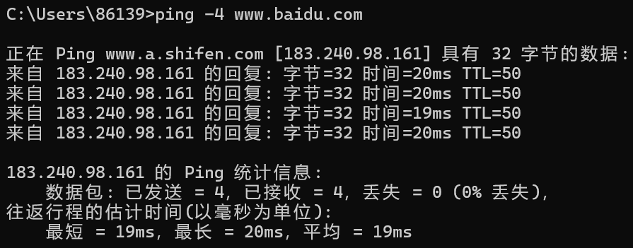
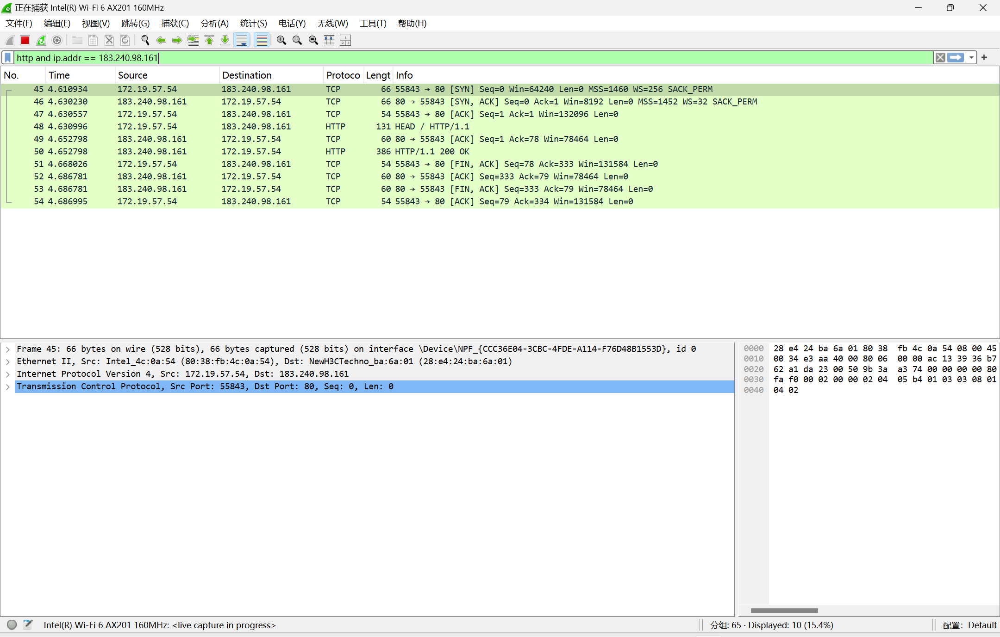
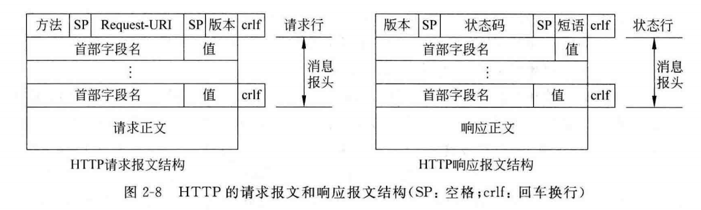
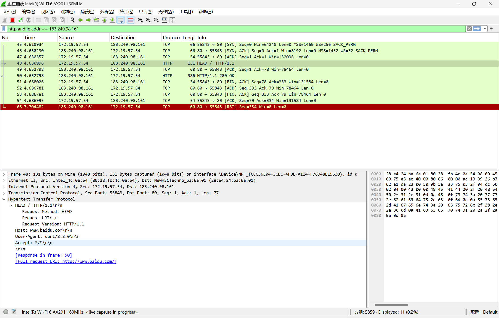
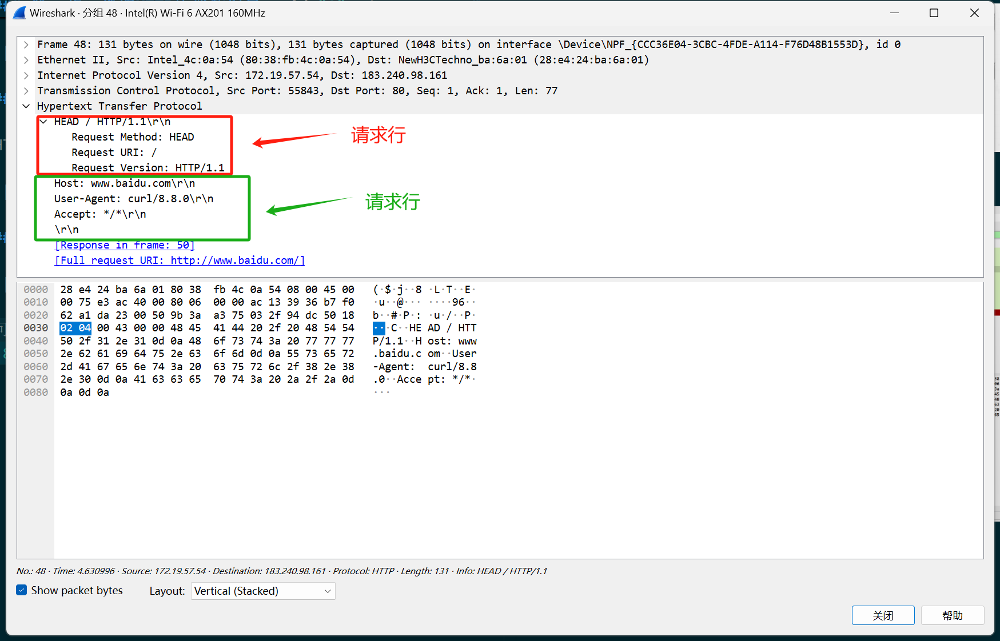
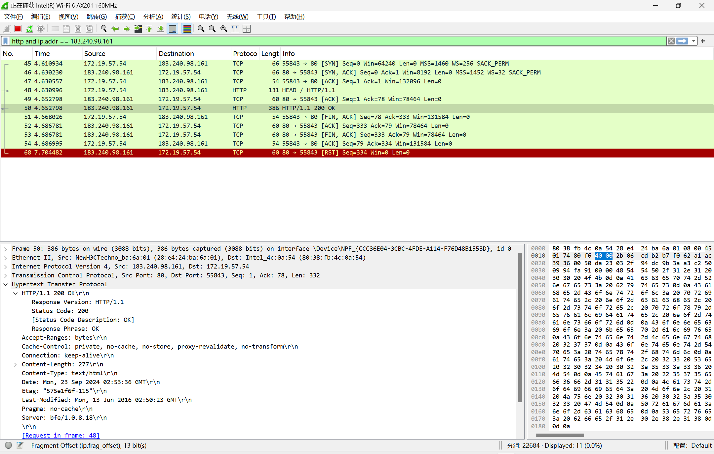
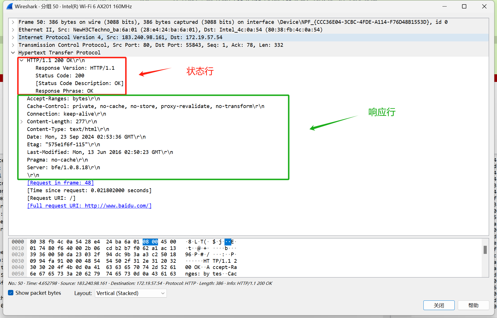
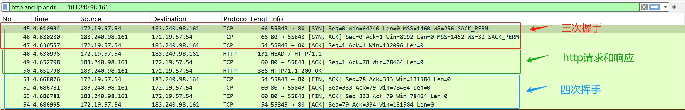

# 第二次实验报告

## 实验 2-3 HTTP协议分析实验

[第一步：抓取HTTP协议数据包](#1)

[第二步：分析请求报文及响应报文](#2)

[第三步：理解HTTP协议的工作流程](#3)

### 第一步：抓取HTTP协议数据包

打开命令行工具，输入 `ping -4 www.baidu.com` 获取 www.baidu.com 的 IPv4 地址 `183.240.98.161` :

在 wireshark 中设置过滤器 `http and ip.addr == 183.240.98.161` 并开始抓包，然后在名命令行工具中输入 `curl -I -4 www.baidu.com` ：

### 第二步：分析请求报文及响应报文

HTTP协议的请求报文及响应报文格式如下：

#### 请求报文

可以看到目的地址为 `183.240.98.161` ，所使用端口为 `80`。

请求行:

- Request Method：请求方法，这里的请求方法是 HEAD，用来获取报文首部
- Request URI：请求的URL，未指定，所以默认是 `/`
- Request Version：请求 HTTP 协议的版本

请求头：

- Host：目标主机
- User-Agent：代理，即浏览器的类型，由于用的不是浏览器，所以这里显示的是命令 curl
- Accept：浏览器可接受的 MIME 类型

#### 响应报文

可以看到目的地址为本机地址 ，所使用端口为 `55843`。

- 状态行：包含版本和响应状态码、状态信息
- 响应头：包含响应的服务器的资源信息，一行一个响应头
- 响应空行：用来间隔/区分响应头和响应体
- 响应体：服务器响应的内容，通常是一个HTML页面的代码或者给客户端的数据。

响应报文跟命令执行的返回结果其实是一样的，因为请求方式是 HEAD，只是获取头部信息，所有这里没有响应体，但能明显看到最后多了一行空格，也就是响应空行。

状态行：

- Response Version：响应版本，因为使用的是HTTP协议，所以这里显示了HTTP的版本
- Status Code：响应状态码，这里的 200 表示请求成功。
- Response Phrase：响应状态码的提示信息

响应头：

- Date：服务端发送响应报文的时间
- Server：服务器和相对应的版本
- Last-Modified：请求的对象创建或者最后修改的时间
- ETag：对象的标志值，如果对象修改了，这个值也会变，用来判断对象是否改变
- Accept-Ranges：支持的范围单位
- Content-Length：内容长度
- Cache-Control：缓存控制
- Expires：这个时间前，可以直接访问缓存副本
- Connection：连接类型，Keep-Alive表示这是一个长链接，可以继续用这个连接通信
- Content-Type：资源文件类型

### 第三步：理解HTTP协议的工作流程

HTTP是简单的请求-响应协议，先建立TCP链接，然后客户端向服务端发送请求，服务端根据请求做出响应，最后关闭TCP链接。

1. HTTP是基于TCP的，需要先通过“三次握手”建立连接

    - 第一个包是第一次握手：本机向百度（183.240.98.161）发送： SYN ，表示这是一个建立连接的请求
    - 第二个包是第二次握手：百度（183.240.98.161）响应本机： SYN+ACK ，表示这是一个接受连接的应答
    - 第三个包是第三次握手，本机向百度（183.240.98.161）发送： ACK ，表示这一个确认请求
    
    发送完确认请求后，本机开启到百度的单向连接通道；百度收到本机的确认请求后，就开启到本机这边的单向连接通道；两边通道都开启以后，就可以进行通信了。

2. TCP连接建立以后，开始HTTP的请求和响应

    - 第一个包是，本机向百度（183.240.98.161）发送了一个：HTTP请求，请求类型是 HEAD
    - 第三个包是，百度（183.240.98.161）向本机发送了：HTTP响应，响应状态码是 200 OK

3. 请求响应结束后，TCP进行'四次挥手'断开连接

    - 第一个包是第一次挥手，本机向百度（183.240.98.161）发送：FIN+ACK，表示这是一个释放连接的请求
    - 第二个包是第二次挥手，百度（183.240.98.161）向本机响应：ACK，表示这是一个确认请求；本机收到后，就会释放到百度的单向连接
    - 第三个包是第三次挥手，百度（183.240.98.161）向本机发送一个FIN+ACK，表示这是一个释放连接的请求
    - 第四个包是第四次挥手，本机向百度（183.240.98.161）响应一个ACK，表示这是一个确认请求；百度收到后，就会释放到本机的单向连接
    
    双向的连接都释放后，TCP连接就关闭了，此次通信结束
