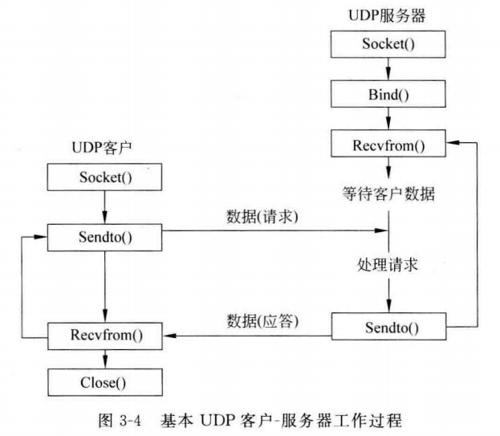
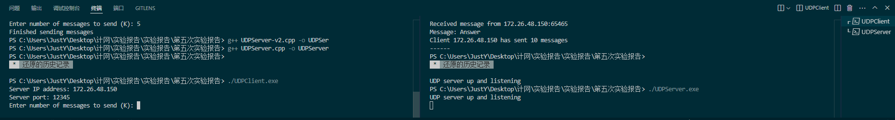
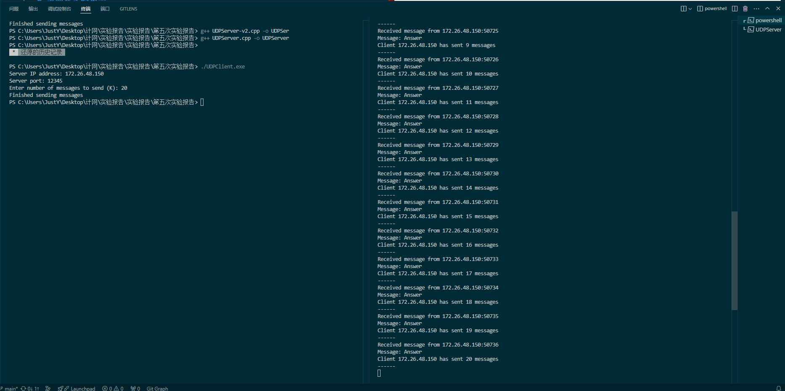
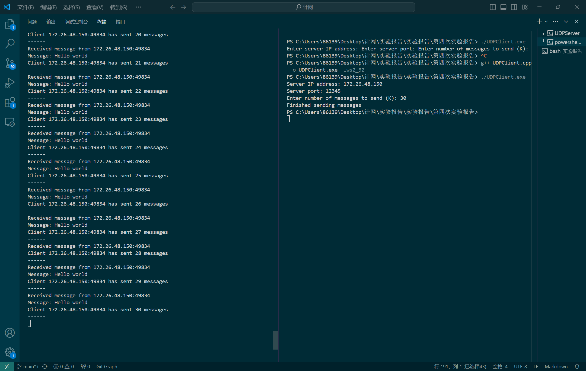
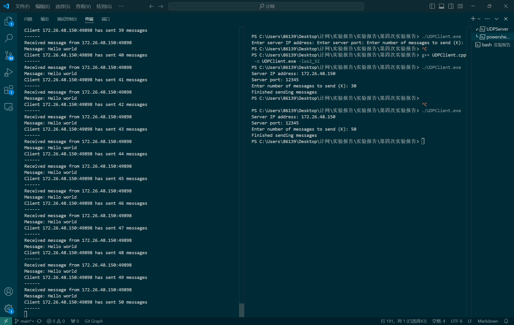

# 第四次实验报告

[实验背景](#1)

[实验内容](#2)

[实验思考](#3)

### 实验背景<a id="1"></a>

**实验要求如下：**

【目的】选择一个自己熟悉的操作系统和语言，编写采用UDP socket 的通信程序；
【要求】编写服务器端和客户端程序。
客户端软件运行时，往服务器端（客户端IP地址+UDP端口为识别）发送用户输入的K个相同内容UDP数据包；
服务器端软件收到用户端的UDP数据后，每收到用户端（采用客户端IP地址+UDP端口为识别）的一个UDP数据包，服务器统计该用户发送的数据包个数并在本地屏幕上显示。
【测试要求】
1）	A机器运行服务器端软件；
2）	在客户端B机器的命令行运行客户端软件2次，K值分别为20，40； 
3）	在A机器也同时运行客户端软件2次，K值分别为30，50； 
4）	退出服务器端软件。

**实验基础知识如下：**

1. UDP通信编程

    UDP，即用户数据报协议，是一种面向无连接的传输层协议。

2. Socket，即"套接字"
    是网络编程中用于实现不同主机上进程间通信的一种技术。它提供了一种将网络通信抽象为文件操作的接口，使得程序员可以通过简单的函数调用来实现复杂的网络通信功能。

3. 软件设计流程图

    

### 实验内容<a id="2"></a>

源代码如下：

**UDPClient.cpp**

```cpp
#include <iostream>  // 包含标准输入输出流库，用于控制台输入输出
#include <Winsock2.h>  // 包含Winsock 2.2的库，用于网络编程
#include <ws2tcpip.h>  // 包含网络编程中使用的额外函数和类型
#include <cstring>  // 包含C风格的字符串处理函数

#pragma comment(lib, "Ws2_32.lib")  // 指示链接器链接Ws2_32.lib库，这个库包含Winsock函数的实现

int main() {
    WSADATA wsaData;  // 用于存储WSAStartup函数的信息
    SOCKET clientSocket = INVALID_SOCKET;  // 初始化客户端套接字为INVALID_SOCKET，表示未创建套接字
    struct addrinfo hints, *serverInfo;  // addrinfo结构用于存储服务信息
    int K, result;  // K用于存储要发送的消息数量，result用于存储函数调用的返回值
    char message[1024] = "Hello world";  // 存储要发送的消息

    // 初始化Winsock
    if (WSAStartup(MAKEWORD(2,2), &wsaData) != 0) {
        std::cout << "Winsock init failed. Error: " << WSAGetLastError() << std::endl;
        return 1;  // 如果初始化失败，输出错误并退出程序
    }

    // 设置hints结构，用于后续的getaddrinfo调用
    ZeroMemory(&hints, sizeof(hints));  // 将hints结构清零
    hints.ai_family = AF_INET;  // 指定IPv4地址族
    hints.ai_socktype = SOCK_DGRAM;  // 指定套接字类型为数据报（UDP）
    hints.ai_protocol = IPPROTO_UDP;  // 指定协议为UDP

    // 服务器的IP地址和端口号
    std::string serverIP = "172.26.48.150";
    int serverPort = 12345;
    std::cout << "Server IP address: " << serverIP << std::endl;
    std::cout << "Server port: " << serverPort << std::endl;
    
    // 用户输入要发送的消息数量
    std::cout << "Enter number of messages to send (K): ";
    std::cin >> K;

    // 使用getaddrinfo获取服务器的地址信息
    result = getaddrinfo(serverIP.c_str(), std::to_string(serverPort).c_str(), &hints, &serverInfo);
    if (result != 0) {  // 如果getaddrinfo调用失败
        std::cout << "getaddrinfo() error: " << result << std::endl;
        WSACleanup();  // 清理Winsock环境
        return 1;  // 退出程序
    }

    // 创建客户端套接字
    clientSocket = socket(serverInfo->ai_family, serverInfo->ai_socktype, serverInfo->ai_protocol);
    if (clientSocket == INVALID_SOCKET) {  // 如果套接字创建失败
        std::cout << "socket() error: " << WSAGetLastError() << std::endl;
        freeaddrinfo(serverInfo);  // 释放addrinfo结构
        WSACleanup();  // 清理Winsock环境
        return 1;  // 退出程序
    }

    // 发送K条消息到服务器
    for (int i = 0; i < K; i++) {
        sendto(clientSocket, message, strlen(message), 0, serverInfo->ai_addr, serverInfo->ai_addrlen);
    }

    // 输出完成消息
    std::cout << "Finished sending messages" << std::endl;

    // 清理资源
    freeaddrinfo(serverInfo);  // 释放addrinfo结构
    closesocket(clientSocket);  // 关闭套接字
    WSACleanup();  // 清理Winsock环境
    return 0;  // 正常退出程序
}
```

**UDPServer.cpp**

```cpp
#include <iostream>  // 包含标准输入输出流库，用于控制台输入输出
#include <Winsock2.h>  // 包含Winsock 2.2的库，用于网络编程
#include <ws2tcpip.h>  // 包含网络编程中使用的额外函数和类型
#include <map>  // 包含标准模板库中的map容器，用于存储客户端计数
#include <cstring>  // 包含C风格的字符串处理函数

#pragma comment(lib, "Ws2_32.lib")  // 指示链接器链接Ws2_32.lib库，这个库包含Winsock函数的实现

int main() {
    WSADATA wsaData;  // 用于存储WSAStartup函数的信息
    SOCKET serverSocket = INVALID_SOCKET;  // 初始化服务器套接字为INVALID_SOCKET，表示未创建套接字
    struct sockaddr_in server, client;  // sockaddr_in结构用于存储服务器和客户端的地址信息
    int recvSize;  // 用于存储接收到的数据的大小
    char recvBuff[1024];  // 存储接收到的数据
    std::map<std::string, int> clientCounter;  // 用于统计每个客户端发送的数据包数量

    // 初始化Winsock
    if (WSAStartup(MAKEWORD(2,2), &wsaData) != 0) {
        std::cout << "Winsock init failed. Error: " << WSAGetLastError() << std::endl;
        return 1;  // 如果初始化失败，输出错误并退出程序
    }

    // 创建服务器套接字
    serverSocket = socket(AF_INET, SOCK_DGRAM, IPPROTO_UDP);
    if (serverSocket == INVALID_SOCKET) {  // 如果套接字创建失败
        std::cout << "socket() error: " << WSAGetLastError() << std::endl;
        WSACleanup();  // 清理Winsock环境
        return 1;  // 退出程序
    }

    // 填充服务器地址信息
    server.sin_family = AF_INET;  // 指定地址族为IPv4
    server.sin_addr.s_addr = INADDR_ANY;  // 指定地址为任意（本机地址）
    server.sin_port = htons(12345);  // 指定端口号，并将端口号转换为网络字节序

    // 绑定套接字到指定的地址和端口
    if (bind(serverSocket, (struct sockaddr *)&server, sizeof(server)) == SOCKET_ERROR) {
        std::cout << "bind() error: " << WSAGetLastError() << std::endl;
        closesocket(serverSocket);  // 关闭套接字
        WSACleanup();  // 清理Winsock环境
        return 1;  // 退出程序
    }

    std::cout << "UDP server up and listening" << std::endl;

    // 服务器主循环，不断接收客户端发送的数据
    while (true) {
        recvSize = sizeof(client);  // 设置接收缓冲区大小
        int cBytes = recvfrom(serverSocket, recvBuff, sizeof(recvBuff), 0, (struct sockaddr *)&client, &recvSize);  // 接收数据
        if (cBytes > 0) {
            recvBuff[cBytes] = '\0'; // 确保字符串以null结尾
            std::cout << "Received message from " << inet_ntoa(client.sin_addr) << ":" << ntohs(client.sin_port) << std::endl;  // 输出客户端地址
            std::cout << "Message: " << recvBuff << std::endl;  // 输出接收到的消息

            // 构建客户端标识字符串
            std::string clientKey = std::string(inet_ntoa(client.sin_addr)) + ":" + std::to_string(ntohs(client.sin_port));
            // 更新客户端发送的消息数量
            clientCounter[clientKey]++;

            // 输出客户端发送的消息数量
            std::cout << "Client " << clientKey << " has sent " << clientCounter[clientKey] << " messages" << std::endl;
            std::cout << "------" << std::endl;
        }
    }

    // 关闭套接字
    closesocket(serverSocket);
    // 清理Winsock环境
    WSACleanup();
    return 0;  // 正常退出程序
}
```

通过以下命令在 Windows 系统上使用 g++ 编译器编译 C++ 源文件，并链接 ws2_32 库以创建可执行文件。ws2_32 库是 Windows Sockets 2 的 API 库，它提供了对网络通信的支持。

```
g++ UDPClient.cpp -o UDPClient.exe -lws2_32
g++ UDPServer.cpp -o UDPServer.exe -lws2_32
```

1. 在 A 机器（IP 地址为：172.26.48.150，端口为：12345）通过 `./UDPServer.exe` 运行服务器端软件，


2. 然后在客户端B机器的命令行运行客户端软件 2 次，K值分别为20，40； 





3. 在A机器也同时运行客户端软件2次，K值分别为30，50；

    在 A 机器（IP 地址为：172.26.48.150，端口为：12345）中另外打开一个终端：

    

    
